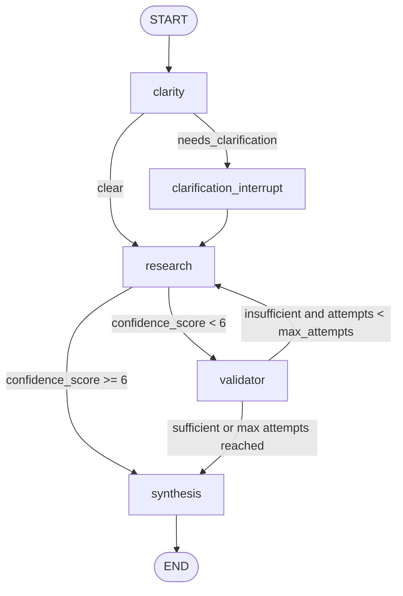

# Company Research Assistant

A multi-agent research assistant built with LangGraph. It gathers company information, supports follow-up questions, validates research quality, and pauses for human clarification when a request is ambiguous.

## Architecture

- `clarity`: checks whether the request names a company or can resolve a follow-up from conversation context.
- `clarification_interrupt`: pauses the graph with `interrupt(...)` when the query is too vague.
- `research`: uses a search tool to gather company news, financial, and recent-development information, then assigns a confidence score from 0 to 10.
- `validator`: reviews research quality and loops back to research when results are insufficient, up to three attempts.
- `synthesis`: produces a user-friendly answer and stores it in conversation history.

## LangGraph State Schema



## Memory and Stock Quotes

The graph stores structured conversation memory in `conversation_turns`,
`conversation_summary`, and `turn_count`. It keeps the latest 10 question and
answer turns active. When the thread grows beyond 10 turns, older turns are
compacted into `conversation_summary` so follow-up context stays available
without letting state grow forever. Each new research prompt includes the
compact summary plus recent Q&A turns, which lets follow-ups such as `who is
CEO?` resolve to the company discussed in the previous exchange.

When `OPENAI_API_KEY` is set, the graph automatically uses OpenAI through
`langchain-openai` for both memory compaction and final answer synthesis. You
can also pass a LangChain-compatible chat model as `summary_llm` or
`answer_llm` to `create_graph(...)`. The same configured LLM is also used as a
fallback company-name extractor when regex matching cannot identify a company.
For follow-up questions, the LLM also resolves whether the question refers to a
company from conversation context. You can override that with `company_llm`. If
no LLM is configured, the graph uses a small deterministic local fallback.

For debugging, every agent-style system prompt, user prompt, and response is
appended to `debug.log` in the project directory by default.

For narrow questions, the synthesis step answers directly instead of returning
a full research report. For example, `who is CEO?` after discussing NVIDIA
returns a concise answer such as `NVIDIA's CEO is Jensen Huang.`

For stock-related questions, such as `What is Apple's stock price?`, the
research agent tries to resolve the company ticker and adds a current quote
block to the final answer. Known company names such as Apple, Microsoft,
Nvidia, Tesla, Amazon, Alphabet/Google, and Meta are mapped automatically. You
can also ask with an explicit ticker, for example `What is NVDA stock doing?`.

## Setup

```bash
python3.12 -m venv .venv
source .venv/bin/activate
python -m pip install -e ".[dev]"
```

Use Python 3.12 or another stable Python from 3.10 through 3.12. The local
Python 3.13 alpha build can fail with compiled dependencies such as
`pydantic_core`.

For live Tavily search:

```bash
export TAVILY_API_KEY="your-key"
```

For OpenAI-backed conversation compaction and answer synthesis:

```bash
export OPENAI_API_KEY="your_openai_api_key_here"
export OPENAI_MODEL="gpt-4o"
```

`OPENAI_MODEL` is optional. If it is not set, the app uses `gpt-4o`.
The CLI also loads `.env` automatically, so you can place `TAVILY_API_KEY`,
`OPENAI_API_KEY`, and `OPENAI_MODEL` there instead of exporting them manually.

Without `TAVILY_API_KEY`, the app uses a local deterministic search tool so the graph and tests still run.

Stock quotes use Yahoo Finance's public chart endpoint through `requests`, then
fall back to Stooq when Yahoo rate-limits or returns no usable quote. If a live
quote still cannot be fetched, the answer includes a clear unavailable note
instead of failing the graph.

## CLI Demo

```bash
python -m company_research_assistant.cli
```

The CLI prints the compiled LangGraph ASCII diagram at startup, then prompts
for company research questions.

Try:

```text
Research Nvidia's recent developments
What about their competitors?
Tell me more about the CEO
```

If you ask a vague query such as `Tell me recent news`, the graph interrupts and asks which company you mean. The CLI resumes the same thread after you answer.

## Programmatic Use

```python
from langgraph.types import Command

from company_research_assistant.graph import create_graph
from company_research_assistant.search import TavilyCompanySearchTool

graph = create_graph(search_tool=TavilyCompanySearchTool.from_env())
config = {"configurable": {"thread_id": "demo-thread"}}

result = graph.invoke({"query": "Research Apple's recent developments"}, config=config)
print(result["final_answer"])

interrupted = graph.invoke({"query": "Tell me recent news"}, config=config)
print(interrupted["__interrupt__"][0].value["question"])

resumed = graph.invoke(Command(resume="Microsoft"), config=config)
print(resumed["final_answer"])
```
